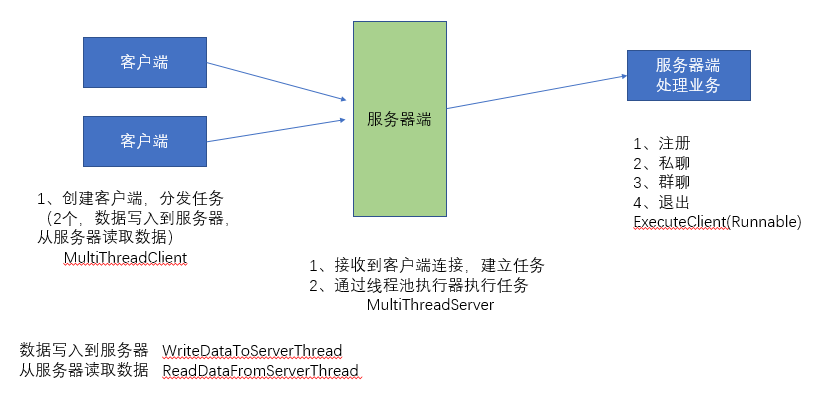

## 项目名称

模拟网络聊天室

## 项目描述：

支持群聊，私聊的网络聊天室

## 使用技术：

+ Java基础
+ Socket编程
+ 多线程
+ MySQL
+ JDBC

##项目功能：

+ 注册
+ 私聊
+ 群聊
+ 退出
 
## 项目实现：



+ 服务端：采用线程池调度器执行服务器与客户端的业务吃力逻辑
+ 客户端：采用读写线程，分别处理交互与服务器数据接收

## 测试结果

+ 平均响应时间：100ms
+ 支持同时在线用户：1000+

## 项目总结

+ 熟悉项目的开发流程（需求，分析，技术选择，设计，编码，测试，发布）
+ 掌握了Java网络编程的常用API和步骤
+ 掌握了多线程的使用和业务处理
+ 熟练运用Maven管理工具

## 优化与扩展

+ 优化
    + 参数严格校验
    + 异常信息处理
    + 用户体验（信息展示）
+ 扩展
    + 数据存储到存储引擎（MySQL）
    + 注册信息存储
    + 增加登录功能（用户名+密码）
    + 历史信息存储
    
## 参与项目

+ 克隆项目到本地

``` git clone https....```

```cd chat-room```

+ 提交项目到仓库   

```git add .```

```git commit -m xxx```

```git push prigin master``` 
